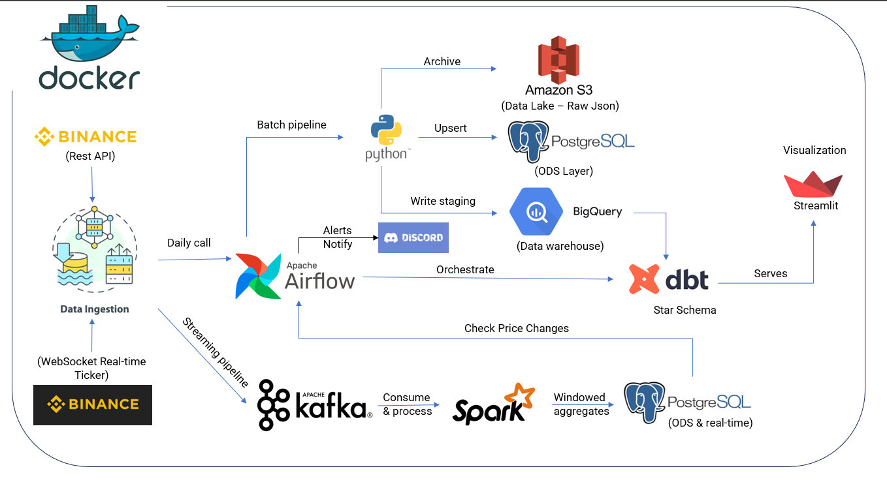
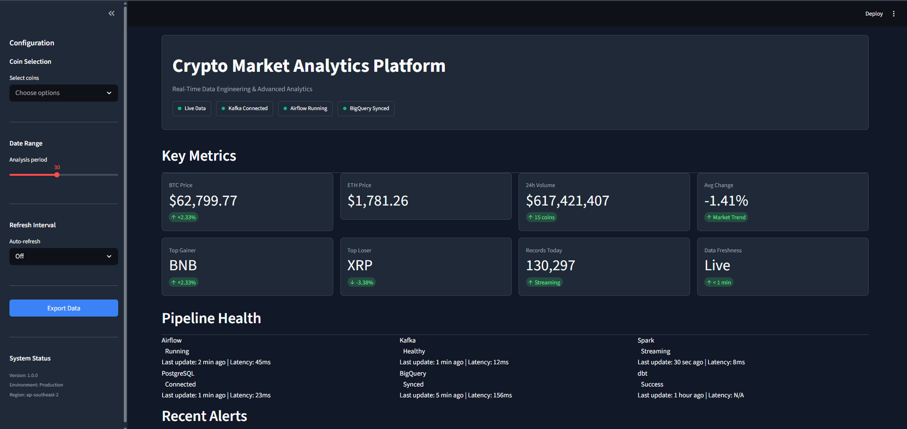
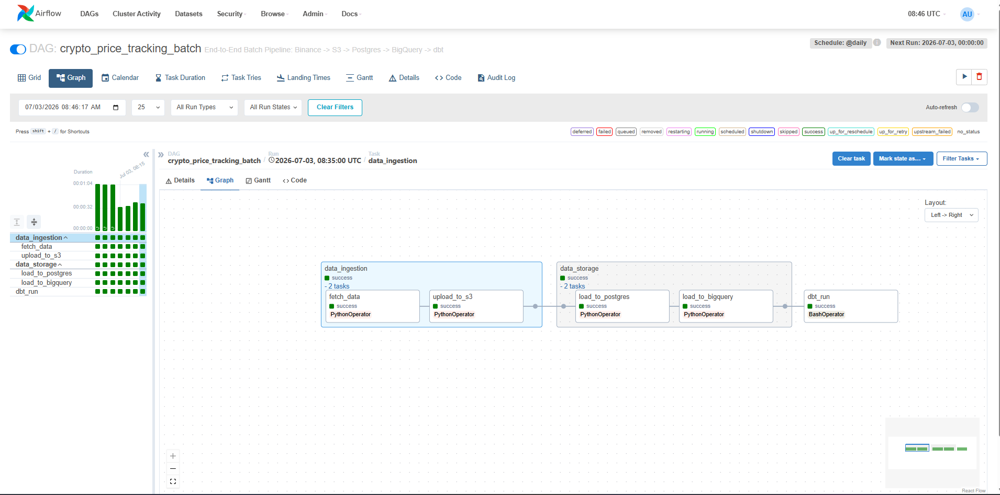
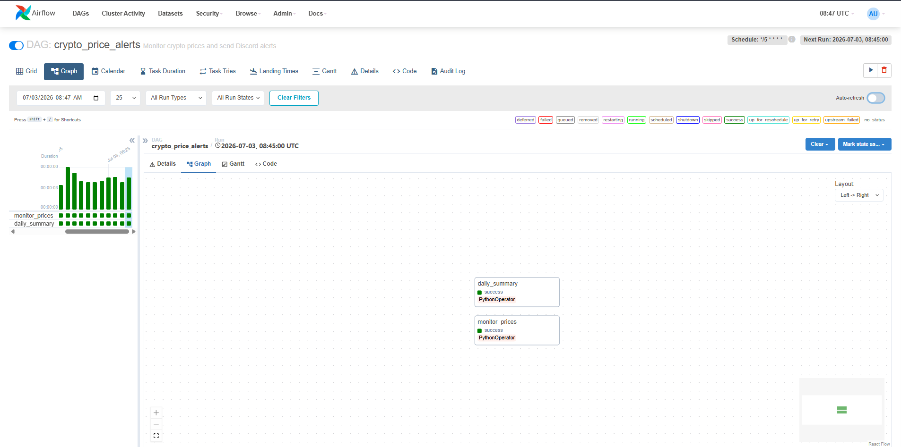
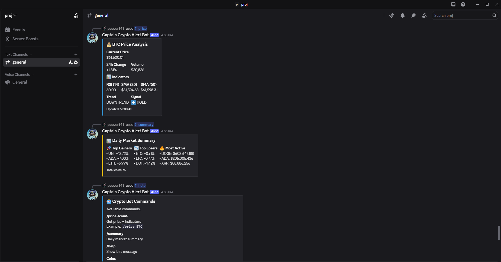
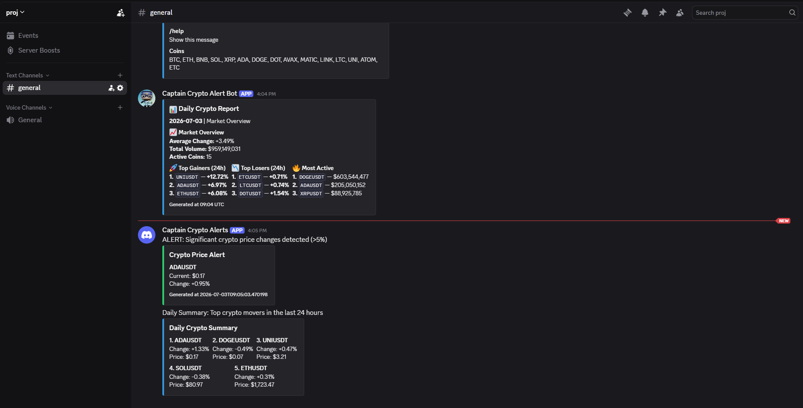
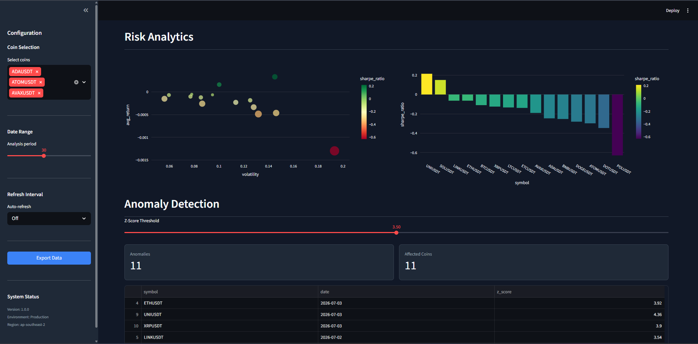
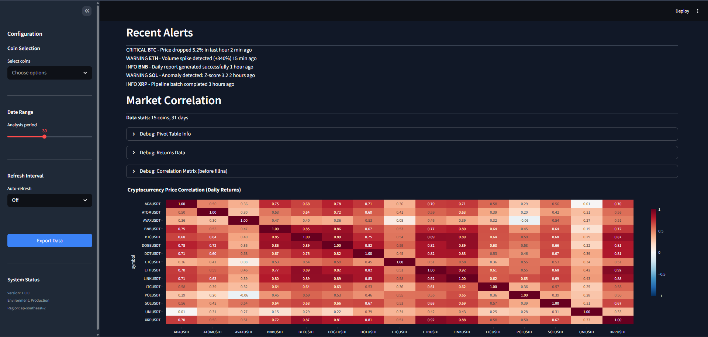
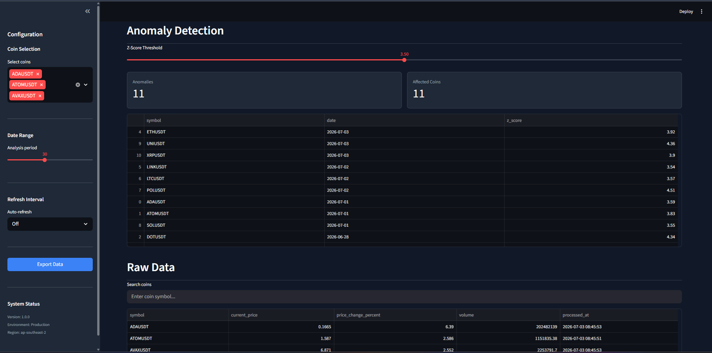

# Real-Time Crypto Market Analytics Pipeline

[](https://www.python.org/)
[](https://airflow.apache.org/)
[](https://spark.apache.org/)
[](https://kafka.apache.org/)
[](https://www.getdbt.com/)
[](https://www.docker.com/)
[](https://www.postgresql.org/)
[](https://cloud.google.com/bigquery)

## Overview

This project demonstrates an end-to-end Data Engineering pipeline for real-time cryptocurrency analytics. It integrates both batch and streaming architectures, enabling data ingestion, transformation, storage, monitoring, visualization, and automated alerting.

A production-grade hybrid data pipeline combining batch processing (Airflow + dbt) with streaming (Kafka + Spark Structured Streaming). Features include automated data ingestion from Binance, multi-layer storage (S3/BigQuery/PostgreSQL), real-time analytics dashboard, and intelligent price alerts via Discord.

## Architecture

### Overall System

The system follows a Lambda Architecture pattern, combining batch and streaming pipelines for comprehensive data processing.

### Batch Pipeline

Binance REST API -> Python Fetcher -> S3 (Raw) -> BigQuery -> dbt -> Dashboard

### Streaming Pipeline

Binance WebSocket -> Kafka -> Spark Structured Streaming -> PostgreSQL -> Dashboard

### Alert Pipeline

Airflow (every 5 min) -> PostgreSQL Query -> Price Change Detection -> Discord Webhook

<details>
<summary><b>View Detailed Architecture</b></summary>

See [Architecture Documentation](docs/architecture/overview.md)
</details>

## Key Features

- Hybrid Batch + Streaming Architecture
- Real-time Cryptocurrency Analytics
- Kafka Message Queue
- Spark Structured Streaming
- Airflow DAG Scheduling
- dbt Star Schema Modeling
- PostgreSQL + BigQuery + Amazon S3
- Interactive Streamlit Dashboard
- Discord Bot Commands
- Automated Price Alerts
- Dockerized Deployment
- CI/CD with GitHub Actions
  
## Production Features
### Architecture
- **TaskGroups**: Logical grouping (data_ingestion, data_storage)
- **Retry Logic**: 3-5 automatic retries with exponential backoff
- **SLA Monitoring**: 1-hour completion target with alerts

### Observability
- **Discord Alerts**: Real-time notifications on success/failure
- **Structured Logging**: Performance metrics & error tracking
- **Pipeline Health**: Real-time monitoring dashboard

### Reliability
- **Idempotent Operations**: Safe to retry without duplicates
- **Error Handling**: Graceful degradation with comprehensive logging
- **Timeout Protection**: 30-minute task timeout
## Demo

### Architecture Overview


### Dashboard Overview

Real-time crypto analytics with **451 records across 33 days** (June 1 - July 5, 2026): prices, volume, market trends, pipeline health
### Airflow DAGs


*Batch and streaming pipeline orchestration*

### Discord Bot

*Interactive commands: /price, /summary, /help*

### Price Alerts

*Automated alerts when price changes >5% within 1 hour*

### Risk Analytics

*Volatility, Sharpe ratio, and Value-at-Risk calculations based on comprehensive historical dataset.*

### Correlation Analysis

*15-18 coin correlation matrix computed from **33 days of historical data**, enabling dynamic filtering and trend analysis.*

### Anomaly Detection

*Z-score based anomaly detection (threshold: 3.5)*


## Tech Stack

### Languages
- Python 3.10+
- SQL

### Frameworks
- Apache Airflow 2.7.0
- Apache Spark 3.5.0
- dbt 1.6.0

### Messaging
- Apache Kafka 3.5.0

### Storage
- PostgreSQL 15+
- Google BigQuery
- Amazon S3

### Visualization
- Streamlit
- Plotly

### Container
- Docker
- Docker Compose

### Cloud
- AWS (S3)
- Google Cloud Platform (BigQuery)

## Project Structure

```text
crypto-market-analytics-pipeline/
── dags/                       # Airflow DAG definitions
├── dashboard/                  # Streamlit application
│   ├── app.py
│   ├── components/
│   └── services/
├── dbt_project/                # dbt data transformations
│   ├── models/
│   ── tests/
├── docker/                     # Custom Dockerfiles
├── docs/                       # Technical documentation
│   ├── architecture/
│   ├── pipeline/
│   ├── dashboard/
│   ├── alerts/
│   ├── data-model/
│   ├── deployment/
│   └── images/
├── scripts/                    # Utility and backfill scripts
├── sql/                        # Database initialization scripts
├── src/                        # Core source code
│   ├── alerting/               # Price monitoring and Discord integration
│   ├── ingestion/              # Binance REST and WebSocket clients
│   ├── processing/             # Data cleaning and Spark streaming
│   ├── storage/                # Loaders for S3, BigQuery, PostgreSQL
│   ├── streaming/              # Kafka producer and Spark consumer
│   ── utils/                  # Configuration and logging
├── tests/                      # Pytest unit and integration tests
├── .env.example                # Environment variable template
├── .gitignore
├── docker-compose.yml          # Local orchestration
└── README.md                   # Project entry point
```
## Quick Start
```
Prerequisites  
Docker & Docker Compose  
Python 3.10+  
AWS Account (S3)  
Google Cloud Account (BigQuery)  
Discord Server (optional)
```
## Installation
```
# 1. Clone repository
git clone https://github.com/cupeedrl/crypto-market-analytics-pipeline.git
cd crypto-market-analytics-pipeline

# 2. Configure environment variables
cp .env.example .env
# Edit .env with your credentials

# 3. Start all services
docker-compose up -d

# 4. Access services
# Airflow: http://localhost:8080
# Streamlit: http://localhost:8501
# PostgreSQL: localhost:5433
```
## Run pipelines

```
Terminal 1: CƠ SỞ HẠ TẦNG

# 1. Bật Cloudflare WARP (không bắt buộc)
# 2. Khởi động Docker
docker compose up -d
# 3. Chờ Kafka khởi động hoàn tất (bắt buộc 45 giây)
Start-Sleep -Seconds 45
# 4. Verify Kafka healthy
docker inspect --format='{{.State.Health.Status}}' crypto_kafka
# Kết quả phải là: healthy

Terminal 2: STREAMING PRODUCER

$env:PYTHONPATH = (Get-Location).Path
python -m src.streaming.binance_ws_producer

Terminal 3: SPARK CONSUMER & DISCORD BOT
# 1. Khởi động Spark Consumer
docker compose up -d spark-consumer
# 2. Chờ Spark ổn định
Start-Sleep -Seconds 20
# 3. Khởi động Discord Bot
$env:PYTHONPATH = (Get-Location).Path
python src/alerting/discord_bot.py
```
Testing
```
# Unit tests
pytest tests/ -v

# Integration tests
pytest tests/test_integration.py -v

# Test alert system
python scripts/test_webhook.py
python scripts/test_price_monitor.py
```

  
### Author: Dat Chu Quoc
🔗 GitHub: https://github.com/cupeedrl  
📧 Gmail: cqdatt41@gmail.com  
💼 LinkedIn: https://www.linkedin.com/in/dat-chu-quoc-583599387/  
📄 MIT License - Feel free to use for learning!  
