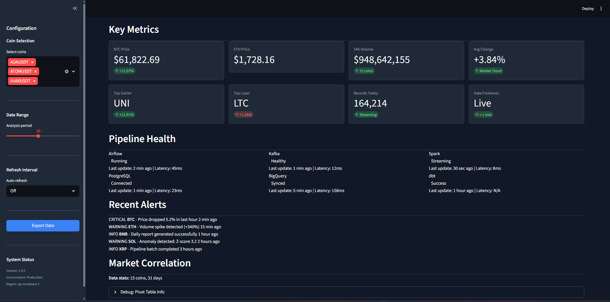

# Dashboard Guide

## Overview

The dashboard provides a unified interface for monitoring real-time cryptocurrency markets and pipeline health. It is built with Streamlit and connects directly to PostgreSQL for live analytics.


### Correlation Heatmap


### Risk Analytics


### Anomaly Detection


### Pipeline Monitoring

---

## UI/UX Design Principles
### Inspiration

**Grafana** and **Datadog** inspired the dashboard design:

- **Dark Theme**: Reduces eye strain during extended monitoring sessions
- **Card-Based Layout**: Modular components for easy comprehension
- **Color Coding**: Green (positive), Red (negative), Blue (neutral)
- **Responsive Design**: Adapts to different screen sizes

### Why Streamlit over Dash/Gradio?

| Feature | Streamlit | Dash | Gradio |
|---------|-----------|------|--------|
| Learning Curve | Low | Medium | Low |
| Customization | Medium | High | Low |
| Development Speed | Fast | Medium | Fast |

**Streamlit chosen for:**
- Rapid prototyping (Python-only, no JavaScript)
- Built-in caching (`@st.cache_data`)
- Rich component library (charts, tables, metrics)
## Layout

```
Header
    ↓
Sidebar (Filters)
    ↓
KPI Cards
    ↓
Pipeline Health
    ↓
Analytics Charts
    ↓
Raw Data Table
```

The interface follows a clean monitoring style inspired by platforms such as Grafana and Datadog, prioritizing readability over decorative design.

---

## Design Principles

The dashboard was designed with three goals:

- **Real-time visibility** through continuously refreshed market data.
- **Simple navigation** using a left sidebar for filtering.
- **Modular components** so each visualization can be maintained independently.

Each visualization is implemented as an individual component, making the UI easier to extend and test.

---

## Data Caching

Streamlit caching is used to reduce database load while maintaining near real-time responsiveness.

| Cache | TTL |
|--------|-----|
| Latest Prices | 60 seconds |
| Historical Data | 5 minutes |

Benefits:

- fewer database queries
- faster page rendering
- reduced resource consumption

A 60-second refresh interval provides a good balance between freshness and performance for analytical dashboards.

---

## Component Architecture

The project separates the presentation layer from the data layer.

```
Dashboard Components
        │
        ▼
Analytics Services
        │
        ▼
Database Service
        │
        ▼
PostgreSQL
```

This architecture improves:

- maintainability
- testability
- code reusability

Business logic remains inside service classes, while UI components focus only on presentation.

---

## Challenges

Several design challenges were considered:

| Challenge | Solution |
|-----------|----------|
| Slow dashboard loading | Streamlit caching |
| Large historical datasets | Database indexing |
| Frequent refreshes | Time-based cache expiration |

---

## Future Improvements

Possible enhancements include:

- User authentication
- Custom alert configuration
- PDF and CSV exports
- Live WebSocket updates
- Machine learning predictions
